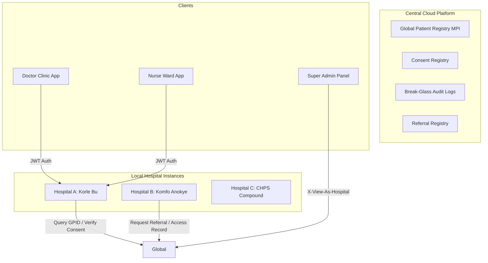

# Chapter 2: System Architecture & Multi-Tenancy Design

## 2.1 The Three-Tier Architectural Paradigm

MedSync EMR is structured as a three-tier, **hub-and-spoke architecture** — a
recognised Health Information Exchange (HIE) pattern that combines the
governance advantages of a centralised repository with the data-locality
benefits of per-facility isolation.

> **On the term "centralised":** MedSync is centralised in the sense that all
> governance artefacts — the Master Patient Index (MPI), the Consent Registry,
> the Referral Registry, and the Break-Glass Audit Log — live in one managed
> central hub.  Clinical PHI (encounters, diagnoses, lab results, prescriptions)
> is stored per-facility (the "spokes") and retrieved on demand through
> consent-gated APIs.  This mirrors the **IHE XDS/XCA** cross-enterprise
> document sharing profile and the widely-cited hub-and-spoke model described
> in the literature (Blobel 2004; ISO/HL7 10781; FHIR Implementation Guide for
> National Patient Index).  The design gives Ghana's tiered health system
> (CHPS → Health Centre → District → Regional → Teaching) a practical path to
> interoperability without requiring every facility to share a single monolithic
> database.

The architecture is designed to support a distributed network of hospitals
while maintaining a single source of truth for cross-facility interoperability
and global patient identification.



### 2.1.1 Central Global Platform (Core Hub)
The global layer operates as a shared repository. It does not store detailed medical files but holds the **Master Patient Index (MPI)**. It maintains:
- **Global Patient Identity (GPID):** Demographics (hashed/encrypted) mapped to unique identity markers (Ghana Card, passport, NHIS).
- **Consent Registry:** Direct record of which facilities have been granted read access by a patient.
- **Break-Glass Audit Registry:** Centralized, immutable ledger tracking emergency record access overrides.
- **Referral Workflows:** Tracks active, completed, or cancelled referral records linking a patient between two facilities.

### 2.1.2 Facility Local Layer (Spokes)
Each hospital acts as an isolated tenant. Detailed, day-to-day medical information is stored locally at the facility level:
- **Clinical Records:** Encounters, vitals records, symptoms, diagnoses, allergy lists.
- **Diagnostics & Therapies:** Lab orders, radiology images, pharmacy prescription queues.
- **Operational Data:** Department setups, staff user rosters, ward registries, bed allocations.

### 2.1.3 Interoperability Layer (HIE Bridge)
The HIE bridge controls the flow of information across facilities. Data can only be pulled from another facility's local store when:
1. An active consent record exists in the Central Registry.
2. An active, accepted referral has been established between the sending and receiving facilities.
3. An emergency "Break-Glass" event is initiated by a clinician (subject to strict logging and review).

---

## 2.2 Database Multi-Tenancy Scoping

To prevent cross-hospital data leakage, MedSync uses a **Shared-Database, Isolated-Query** multi-tenancy model. Every database query is programmatically scoped to the user’s assigned facility.

### 2.2.1 Centralised Scoping Helpers (`api/utils.py`)

Rather than applying hospital filters ad-hoc in individual views, all
multi-tenant queryset scoping is consolidated in a single gateway module —
`medsync-backend/api/utils.py`.  Every data-access view calls the appropriate
helper before querying clinical data:

```python
# Examples of the scoping gateway pattern
qs = get_patient_queryset(user, get_effective_hospital(request))
qs = get_encounter_queryset(user, hospital)
qs = get_lab_order_queryset(user, hospital)
```

Each helper internally calls `_scope_hospital(user, effective_hospital)`, which
enforces the super-admin matrix:

```python
def _scope_hospital(user, effective_hospital=None):
    """Single source of truth for hospital-level query scoping."""
    if user.role == "super_admin":
        if effective_hospital:           # X-View-As-Hospital header
            return effective_hospital
        if user.hospital_id is None:
            return None                  # Unfiltered — sees all hospitals
        return user.hospital             # SA with own hospital → treated normally
    return user.hospital or None         # All other roles → own hospital or none()
```

This approach was chosen over a model-layer manager because it keeps the
Django migration engine simple and makes the scoping logic explicit and
readable in every view — important for code review and security auditing.
The canonical scoping matrix (super-admin / view-as / role-based) lives in
one place and is exercised by a dedicated RBAC test suite
(`api/tests/test_rbac_hospital_scoping.py`).

### 2.2.2 Scoping Logic by User Role
The system implements granular scoping based on the user's role to prevent "lateral privilege escalation" inside a single hospital:
- **Hospital Admins & Receptionists:** Can query all patients registered at their assigned facility (`registered_at=hospital`).
- **Doctors:** Restricted to patients registered at their hospital (`registered_at=hospital`) to maintain HIPAA isolation. They can only query cross-facility records if authorized by a consent/referral/break-glass link.
- **Nurses:** Further restricted only to patients currently admitted to their assigned ward (`ward=user.ward` where `discharged_at__isnull=True`).
- **Lab Technicians:** Scoped only to patients who have active, pending lab orders for their assigned lab unit (`lab_unit=user.lab_unit`, `result_submitted=False`).

---

## 2.3 Super Admin Projection & View-As Security

A Super Admin manages the entire network and does not belong to a single hospital (`hospital_id = None`). To perform troubleshooting or administrative audits for a specific hospital, the system allows them to project themselves into a facility's scope.

### 2.3.1 The X-View-As-Hospital Header
A Super Admin can attach an `X-View-As-Hospital` header to their API requests containing a target hospital UUID. The backend helper `get_effective_hospital(request)` parses this header and dynamically applies the target hospital filter to the queryset.

### 2.3.2 Privilege Escalation Safeguards
To prevent compromised Super Admin accounts from querying arbitrary patient databases, MedSync implements the **SuperAdminHospitalAccess** model:
- **Explicit Grant:** A Super Admin can only project into a hospital if there is a matching `SuperAdminHospitalAccess` record (granted by another Super Admin or system protocol).
- **Fail-Closed Verification:** If the header specifies a hospital for which access is not explicitly granted, the backend logs a `VIEW_AS_HOSPITAL` access-denied event and throws a `PermissionDenied` error.
- **Audit Logging:** Every project switch via the header is tracked in the chained, tamper-evident audit logs, capturing the target hospital, timestamp, Super Admin details, and whether the attempt was authorized.
