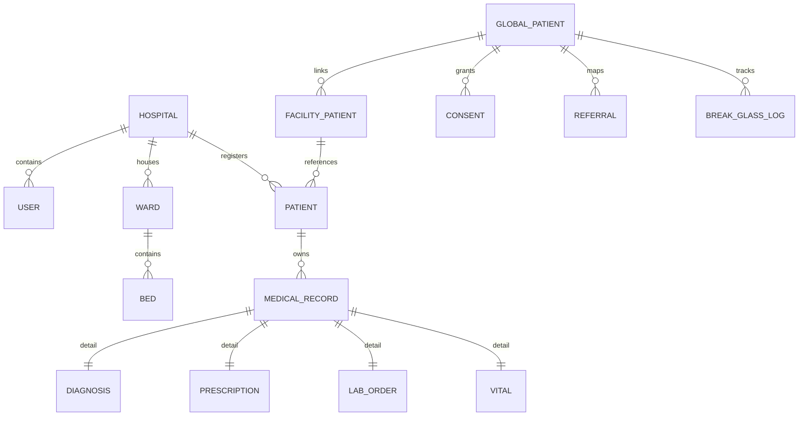

# Chapter 3: Database Design & Cryptographic Protection

## 3.1 Entity Relationship Overview
MedSync EMR uses a centralized relational schema in SQLite (for development) and PostgreSQL (for production). The entities are divided into four main domains: core platform operations, patient demographics, clinical records, and cross-hospital interoperability (HIE).



---

## 3.2 Core Platform Schema (`core/models.py`)

### 3.2.1 Hospital
Represents a medical facility registered on the inter-hospital network.
- `id` (UUID, PK)
- `name` (CharField)
- `region` (CharField)
- `nhis_code` (CharField, Unique)
- `facility_type` (Choices: CHPS, HEALTH_CENTRE, DISTRICT_HOSPITAL, REGIONAL_HOSPITAL, TEACHING_HOSPITAL)
- `ip_subnets` (JSONField: allowed CIDR ranges for the facility network, e.g., `["192.168.1.0/24"]`)
- `is_archived` (BooleanField: soft-delete flag)

### 3.2.2 User
Custom authentication model replacing Django's default User.
- `id` (UUID, PK)
- `email` (EmailField, Unique)
- `role` (Choices: super_admin, hospital_admin, doctor, nurse, receptionist, lab_technician, pharmacy_technician, radiology_technician, billing_staff, ward_clerk)
- `account_status` (Choices: pending, active, inactive, suspended, locked)
- `totp_secret` (Encrypted CharField: Google Authenticator secret)
- `failed_login_attempts` (IntegerField)
- `locked_until` (DateTimeField)
- `must_change_password_on_login` (BooleanField)

### 3.2.3 AuditLog
Tamper-evident log chain tracking system actions.
- `id` (IntegerField, PK)
- `user` (ForeignKey -> User)
- `action` (CharField)
- `resource_type` (CharField)
- `resource_id` (CharField: sanitized/opaque identifier)
- `chain_hash` (CharField, Unique: SHA-256 block hash linking to the previous log block)
- `signature` (CharField: HMAC signature verifying authenticity)
- `risk_tier` (IntegerField: AAL risk rating context)

---

## 3.3 Patient Management Schema (`patients/models.py`)

### 3.3.1 Patient
Represents a hospital's local registry of a patient.
- `id` (UUID, PK)
- `ghana_health_id` (CharField, Unique)
- `full_name` (CharField, Index)
- `date_of_birth` (Encrypted DateField) — **Protected PHI**
- `gender` (Choices: male, female, other, unknown)
- `national_id` (Encrypted CharField) — **Protected PHI**
- `nhis_number` (Encrypted CharField) — **Protected PHI**
- `passport_number` (Encrypted CharField) — **Protected PHI**
- `is_archived` (BooleanField)

### 3.3.2 Appointment
Tracks outpatient visits, emergency triages, and walk-in queues.
- `id` (UUID, PK)
- `patient` (ForeignKey -> Patient)
- `scheduled_at` (DateTimeField)
- `status` (Choices: scheduled, checked_in, completed, cancelled, no_show)
- `urgency` (Choices: routine, urgent, emergency)
- `triage_color` (Choices: red, yellow, green, blue) — **Emergency Department Triage**
- `chief_complaint` (TextField)
- `triage_vitals` (JSONField: blood pressure, SpO2, heart rate, pain scale capture)

### 3.3.3 Invoice & InvoiceItem
Minimal hospital billing module.
- `id` (UUID, PK)
- `amount_cents` (IntegerField: billing amount in GHS cents)
- `payment_method` (Choices: cash, card, nhis, insurance)
- `nhis_claim_status` (CharField: track submittals to GHS national insurance claims API)

---

## 3.4 Clinical Records Schema (`records/models/`)

### 3.4.1 MedicalRecord (Base)
A base class supporting polymorphic records (Diagnoses, Prescriptions, Lab Results, Vitals).
- `id` (UUID, PK)
- `patient` (ForeignKey -> Patient)
- `hospital` (ForeignKey -> Hospital)
- `record_type` (CharField)
- `retention_until` (DateTimeField) — **Calculated Legal Retention Period**
- `record_version` (IntegerField: Optimistic Locking version number)
- `is_amended` (BooleanField)

> **Ghana MoH Retention Calculation:**
> Under Ghana Ministry of Health guidelines, records must be retained for at least **10 years** for adults. For pediatric patients (under 18), they must be retained for **25 years** from majority (18 + 25 = 43 years old).
> ```python
> if age_years < 18:
>     years_until_majority = 18 - age_years
>     return now + timedelta(days=(25 + years_until_majority) * 365)
> return now + timedelta(days=10 * 365)
> ```
> `assert_deletable()` checks `retention_until` and raises a `ValidationError` if deleted before expiration.

### 3.4.2 Vital
Clinical vitals tracking.
- `temperature_c`, `pulse_bpm`, `bp_systolic`, `bp_diastolic`, `spo2_percent` (Encrypted Decimal/Integer fields)
- `gcs_score` (Glasgow Coma Scale: 3-15)
- `avpu_score` (Choices: A, V, P, U)
- `news2_score` (National Early Warning Score 2: calculated dynamically on save)

### 3.4.3 Prescription & MedicationSchedule (MAR)
Prescription entries and active nursing administration records.
- `drug_name` (CharField)
- `dosage` (CharField)
- `dispense_status` (Choices: pending, dispensing, partially_dispensed, dispensed, cancelled)
- `MedicationSchedule` (MAR): Tracks scheduled medication doses and status (`scheduled`, `administered`, `missed`, `held`, `refused`).

---

## 3.5 Interoperability Schema (`interop/models.py`)

### 3.5.1 GlobalPatient
A unified patient record matching patients globally across clinic branches.
- `id` (UUID, PK)
- `national_id` (Encrypted CharField, Unique) — **Ghana Card Identifier**
- `data_residency_country` (CharField, default: "GH") — **NDPA 2012 Compliance**
- `data_residency_locked` (BooleanField: restricts cross-facility views to local facilities)

### 3.5.2 Consent
A patient’s authorization granting an external facility permission to query their files.
- `global_patient` (ForeignKey -> GlobalPatient)
- `granted_to_facility` (ForeignKey -> Hospital)
- `scope` (Choices: SUMMARY, FULL_RECORD)
- `is_active` (BooleanField)
- `withdrawn_at` (DateTimeField: user revocation audit trail)

### 3.5.3 BreakGlassLog
Clinician emergency access logs without explicit patient consent.
- `global_patient` (ForeignKey -> GlobalPatient)
- `accessed_by` (ForeignKey -> User)
- `reason_code` (Choices: life_threatening_emergency, unconscious_patient, mass_casualty, etc.)
- `expires_at` (DateTimeField: **15-minute** window expiration — configurable via `BREAK_GLASS_WINDOW_MINUTES` environment variable, default 15 minutes)

---

## 3.6 Protected Health Information (PHI) Encryption

To achieve compliance with the **Ghana Data Protection Act (NDPA 2012)** and **HIPAA**, MedSync enforces **Field-Level Encryption (FLE)**. 

### 3.6.1 Encryption Framework
Using `django-cryptography`, the system automatically encrypts columns at rest:
- **Algorithms:** Behind the scenes, columns are encrypted using AES-256.
- **Key Storage:** Keys are derived from the Django `SECRET_KEY` setting.
- **Database Storage:** Ciphertexts are stored as bytes in the database, keeping index lookups safe but preventing SQL dumps or physical server thefts from exposing raw patient records.

### 3.6.2 Encrypted Database Fields
The following fields are strictly encrypted:
1. **Patient & GlobalPatient Demographics:** `date_of_birth`, `national_id`, `passport_number`, `nhis_number`, `phone`, `email`.
2. **Clinical Records:** `Allergy.allergen`, `Allergy.reaction_type`, `Diagnosis.icd10_description`, `Diagnosis.notes`, `LabResult.result_value`.
3. **Vitals Logs:** `Vital.temperature_c`, `Vital.pulse_bpm`, `Vital.bp_systolic`, `Vital.bp_diastolic`, `Vital.spo2_percent`, `Vital.gcs_score`, `Vital.news2_score`.
