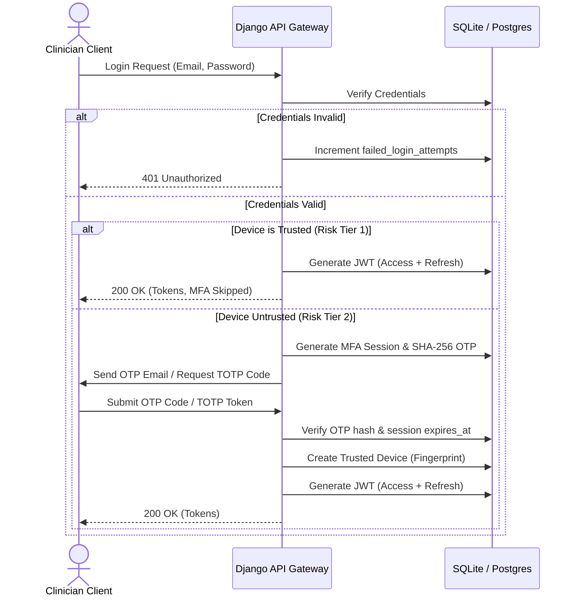

# Chapter 4: Security & Compliance Implementation

## 4.1 Authentication Lifecycle & Multi-Factor Authentication (MFA)
To comply with HIPAA Technical Safeguards and the Ghana NDPA, MedSync implements a robust multi-factor authentication protocol. Accessing clinical or administrative endpoints requires verification of both knowledge (passwords) and possession (email OTP, TOTP app, or hardware Passkeys).



### 4.1.1 Two-Phase JWT + MFA Flow
1. **Primary Authentication:** The client submits email and password. If correct, the backend checks for a trusted device (sliding 30-day cookie trust). If trust is valid, JWTs are issued immediately.
2. **Secondary Challenge:** If the device is unrecognized, the API returns a temporary MFA ticket token. The user must submit a valid 6-digit TOTP code or email OTP. Upon verification, the final access/refresh tokens are returned.

### 4.1.2 MFA Methods
- **TOTP Authenticator:** Users link their profiles to apps like Google Authenticator. The server stores an encrypted `totp_secret` (AES-256) and verifies standard time-based tokens.
- **Passkeys (WebAuthn):** Clinicians can register hardware security keys or biometrics, enabling cryptographic verification.
- **MFA Backup Codes:** Cryptographically generated recovery tokens. The hashes are stored encrypted to prevent extraction.

---

## 4.2 Account Lockout & Protection Controls
To defend against automated brute-force attacks, MedSync tracks failed logins:
- **Lockout Threshold:** Accounts are locked after **5 consecutive failed attempts**.
- **Lockout Cooldown:** The account remains locked (`account_status = "locked"`) for **15 minutes** (`locked_until`).
- **MFA Rate Limiting:** Limits OTP verification attempts. If a user fails to verify MFA **10 times in 1 hour**, a global lockout is triggered via the `MFAFailure` model.

---

## 4.3 Adaptive Trust & Step-Up Verification

### 4.3.1 Trusted Device Fingerprinting
To balance convenience with security, the frontend generates a hardware-based device fingerprint:
$$\text{Device Fingerprint} = \text{SHA-256}(\text{User-Agent} + \text{Screen Resolution} + \text{Timezone})$$

If the fingerprint matches a `TrustedDevice` record linked to the user, and the 30-day window has not expired, secondary MFA is bypassed. The trust window is refreshed on each successful login.

### 4.3.2 Step-Up MFA Session
High-risk actions—such as requesting cross-facility patient records or initiating a break-glass bypass—require **Step-Up Verification**:
- The user requests verification for a specific action.
- The server generates a short-lived `StepUpSession` (5 minutes) and transmits an email OTP.
- Upon correct code submission, the server returns a temporary Step-Up JWT header token.
- Custom decorators (`@requires_step_up(action="...")`) inspect this token before letting the request hit the database.

---

## 4.4 Tamper-Evident Hash-Chain Audit Logging

A core feature of MedSync's security architecture is its chained, tamper-evident audit logging mechanism. This design prevents malicious database administrators or compromised accounts from modifying historical access records to cover their tracks.

### 4.4.1 Cryptographic Chain Design
Each `AuditLog` entry acts like a block in a private blockchain. The `chain_hash` of a new entry is cryptographically bound to the hash of the preceding entry:

$$\text{chain\_hash}_N = \text{SHA-256}(\text{chain\_hash}_{N-1} + \text{user\_id} + \text{action} + \text{resource\_type} + \text{resource\_id} + \text{nonce})$$

```python
# From core/models.py
prev = AuditLog.objects.filter(user=self.user).order_by("-timestamp").first()
prev_hash = prev.chain_hash if prev else "0"
nonce = uuid.uuid4().hex

# Tamper-evident chain hash
data = f"{prev_hash}{self.user_id}{self.action}{self.resource_type or ''}{self.resource_id or ''}{nonce}"
self.chain_hash = hashlib.sha256(data.encode()).hexdigest()
```

### 4.4.2 HMAC Signature
To prevent an attacker from modifying a block and recalculating all subsequent hashes in the chain, the server signs each audit entry with a secret signing key (`AUDIT_LOG_SIGNING_KEY`):

$$\text{signature} = \text{HMAC-SHA-256}(\text{AUDIT\_LOG\_SIGNING\_KEY}, \text{data})$$

```python
self.signature = hmac.new(
    key.encode("utf-8"),
    data.encode("utf-8"),
    hashlib.sha256,
).hexdigest()
```

If a row's values are altered, the `chain_hash` will fail validation. If the attacker attempts to recalculate the chain hash, the `signature` verification will fail because the attacker lacks the secret signing key.

### 4.4.3 PHI Sanitization
To prevent leaking sensitive patient information into system logs, `resource_id` fields are sanitized. Any input string exceeding 64 characters is automatically replaced with `[REDACTED]` before save.
