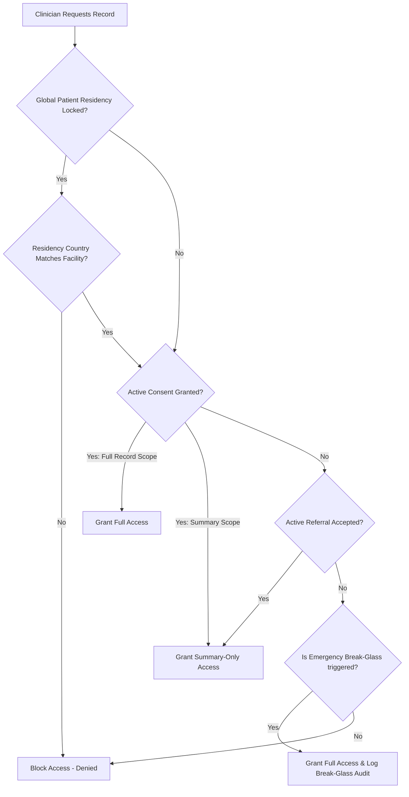
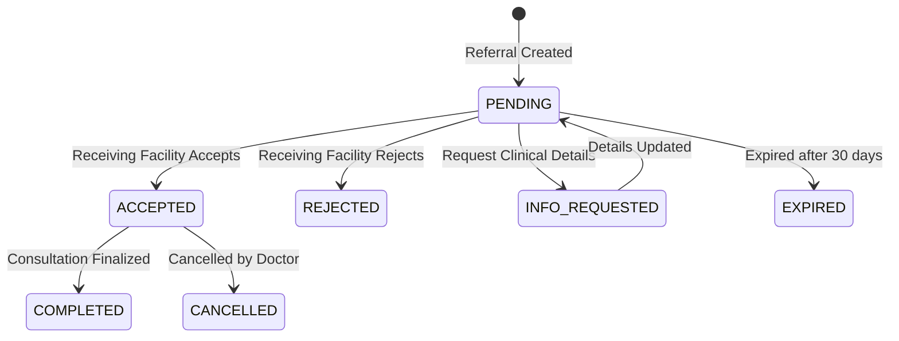

# Chapter 5: Interoperability & Cross-Facility Workflows

## 5.1 Global Patient Identity Resolution (GPID)
To facilitate patient sharing between separate hospitals, MedSync implements a centralized **Master Patient Index (MPI)** registry. 

- **GlobalPatient vs. FacilityPatient:** The global platform holds a `GlobalPatient` record containing demographic identifiers (name, DOB, NHIS number, National ID) encrypted at field level. Each clinic maintains a local `Patient` record, linked to the global registry via a `FacilityPatient` mapping table.
- **Automatic MPI enrollment:** Every patient registered at any facility is **automatically enrolled** in the GlobalPatient MPI and linked via a `FacilityPatient` bridge record. The `_link_to_global_registry()` helper in `api/views/patient_views.py` runs inside the same transaction as patient creation — finding or creating the GlobalPatient and creating the facility link without any manual backfill. This ensures the inter-hospital access layer is populated from day one.
- **Identity Matching:** When a receptionist searches for an incoming referred patient, the system queries matching attributes on the central registry using Python-level comparison on encrypted fields (field-level encryption prevents DB-level equality filtering), ensuring patients are mapped to their existing global profile instead of creating duplicates.

---

## 5.2 Consent Management & Gateway Scopes
Patient data sharing across clinics is strictly gated by a patient-driven consent framework.

### 5.2.1 Consent Scopes
Patients control the level of access external hospitals receive:
- **SUMMARY Scope:** Allows the external facility to view basic vitals, primary allergy histories, and general medical history summaries.
- **FULL_RECORD Scope:** Allows access to all clinical encounters, laboratory results, nursing notes, and prescriptions.
- **Exclusion Scopes:** Patients can apply exclusion rules (`ConsentScope`) to withhold specific medical areas (e.g., "HIV", "MentalHealth", "Reproductive"). These exclusions are **actively enforced** in `cross_facility_records()` — records whose `category` field matches an excluded scope are filtered out of the cross-facility response before it is returned to the requesting clinician. A list of `excluded_categories` is included in the response payload so the UI can display a notice to the viewing clinician. This implements the NDPA 2012 data-minimisation principle at the application layer.

### 5.2.2 Revocation and Expiry
All consents carry an `expires_at` timestamp. Additionally, under the **Ghana NDPA 2012 § 26**, patients hold the absolute right to withdraw consent at any time. When a withdrawal is recorded, `is_active` is marked `False`, and `withdrawn_at`, `withdrawn_by`, and `withdrawal_reason` are captured in the consent ledger for auditing purposes.

---

## 5.3 Referral State Machine
Referrals between hospitals manage both operational patients and clinical records. The transition of referrals follows a strict state machine:

- **Data Flow:** When a referral is created, the sending doctor specifies `record_ids_to_share` and `encounter_ids_to_share`. This grants the receiving hospital a temporary, read-only consent gateway scoped exclusively to those selected assets, preserving general record privacy.
- **Optimistic Concurrency:** To prevent race conditions (e.g., two receptionists updating a referral state simultaneously), the `Referral` model tracks a `version` field. Updates fail if the database version exceeds the loaded object's version.

---

## 5.4 Emergency Break-Glass Overrides
In acute, life-threatening scenarios (e.g., unconscious emergency room intake) where consent cannot be obtained from the patient:

- **Bypass Authorization:** A doctor can trigger a "Break-Glass" override to bypass consent blocks.
- **Required Inputs:** The doctor must supply a clinical reason code (`unconscious_patient`, `life_threatening_emergency`, etc.) and a detailed justification.
- **Temporal Bound:** The override creates a short-lived access ticket (`BreakGlassLog.expires_at`). The window duration is configurable via `BREAK_GLASS_WINDOW_MINUTES` (default: **15 minutes**). Once expired, access is instantly revoked.
- **Security Oversight:** All break-glass events generate high-severity alerts (`ClinicalAlert` status is marked active). Hospital admins review these logs monthly. Super Admins can manually flag individual events (`excessive_usage = True`) when reviewing the global break-glass list to mark potential credential abuse for follow-up.

---

## 5.5 Data Residency & NDPA 2012 Constraints
To satisfy local regulatory laws, MedSync implements strict data localization capabilities:
- **Residency Fields:** The `GlobalPatient` model contains a `data_residency_country` code (e.g., "GH" for Ghana) and a `data_residency_locked` flag. The `Hospital` model now carries a matching `country` field (ISO 3166-1 alpha-2, default "GH" — migration `core/0042_hospital_country`).
- **Enforcement:** If `data_residency_locked` is marked `True`, both the interop REST gateway (`can_access_cross_facility()` in `api/utils.py`) and the FHIR access path (`_can_access_patient_fhir()`) compare `facility.country` against `global_patient.data_residency_country`. If they differ, access is blocked immediately, overriding any active consent or break-glass triggers, and a `DATA_RESIDENCY_DENIED` security alert is logged. Both enforcement paths now use the same `Hospital.country` field, eliminating the previous inconsistency where one path always denied and the other always passed.
- **Unified consent semantics:** The FHIR and REST cross-facility access paths previously used divergent consent check logic (e.g. FHIR granted FULL_RECORD on PENDING referrals). Both paths now call the single canonical `can_access_cross_facility()` function, ensuring consistent authorization behaviour across all access routes.
