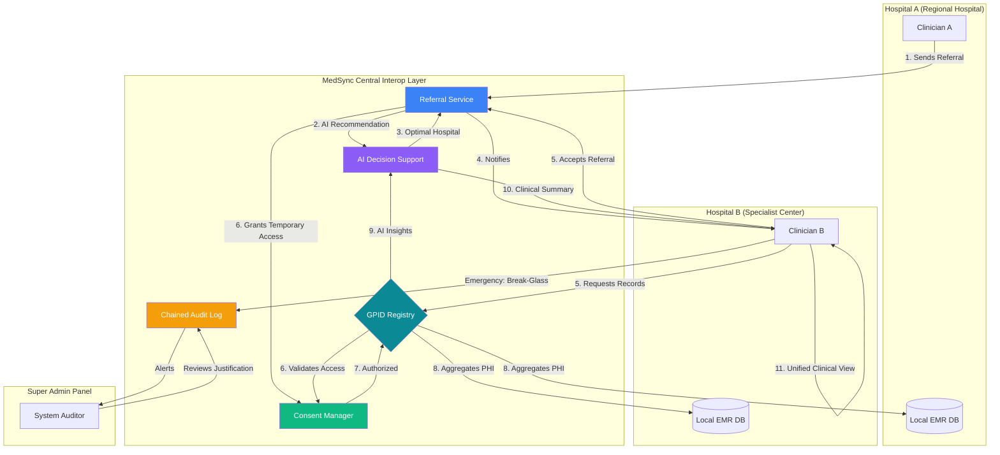
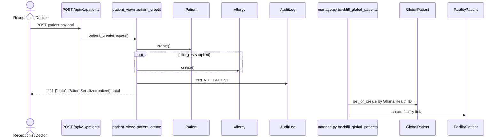
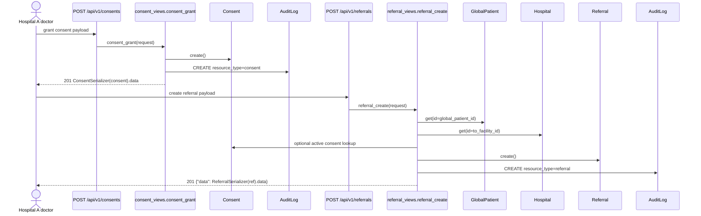
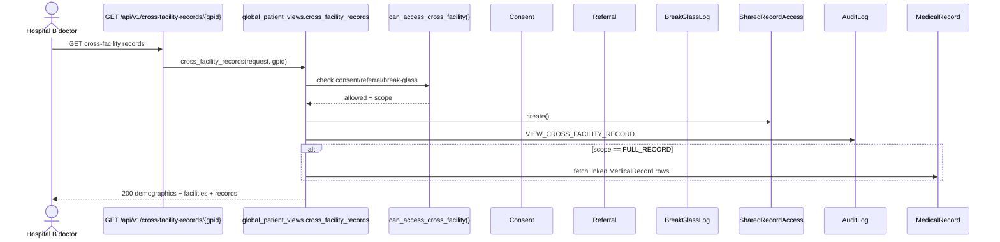
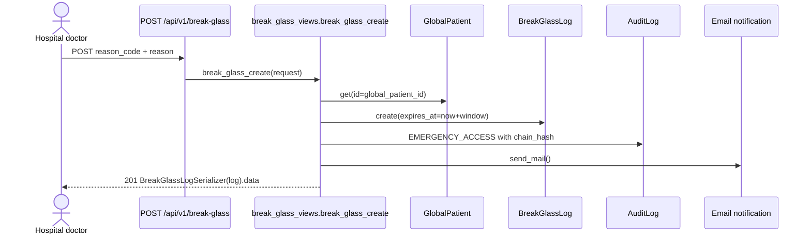
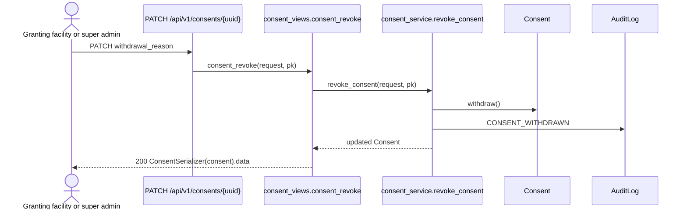
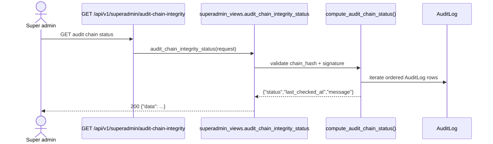

# MedSync System Overview: Multi-Hospital Interoperability

This diagram illustrates the architectural flow of the MedSync EMR system, highlighting how multiple hospitals interact through a centralized health registry and how security mechanisms (Consents & Break-Glass) are audited.

### Key Components:
1.  **GPID Registry**: A centralized database mapping national identities to local facility records.
2.  **Referral Service**: Orchestrates the transfer of patient care between facilities.
3.  **Consent Manager**: Enforces patient privacy by requiring explicit consent or an active referral for data sharing.
4.  **Chained Audit Log**: A tamper-evident ledger that records all cross-facility data access, including emergency break-glass events.
5.  **Audit Review**: A specialized interface for Super Admins to monitor and validate the legitimacy of emergency access events.
6.  **AI Decision Support**: To improve clinical decision quality within the inter-hospital context, an AI-assisted triage and referral recommendation layer was added. This identifies the optimal destination facility based on clinical urgency and specialty availability.

## Viva sequence diagrams

### 1) Register patient at Hospital A

**Path:** `POST /api/v1/patients` → `patient_views.patient_create`
**Models:** `Patient`, `Allergy`, `GlobalPatient`, `FacilityPatient`, `AuditLog`
**Audit:** `CREATE_PATIENT`
**Response:** `{"data": PatientSerializer(patient).data}`

### 2) Refer patient with consent

**Path:** `POST /api/v1/consents` then `POST /api/v1/referrals`
**Models:** `Consent`, `GlobalPatient`, `Hospital`, `Referral`, `AuditLog`
**Audit:** `CREATE` on consent, `CREATE` on referral
**Response:** consent serializer, then referral serializer

### 3) Hospital B doctor reads shared records

**Path:** `GET /api/v1/cross-facility-records/<global_patient_id>/`
**Models:** `Consent`, `Referral`, `BreakGlassLog`, `SharedRecordAccess`, `MedicalRecord`, `AuditLog`
**Audit:** `VIEW_CROSS_FACILITY_RECORD`
**Response:** `demographics`, `scope`, `facilities`, `records`, `read_only`, `expires_at`

### 4) Break-glass emergency access

**Path:** `POST /api/v1/break-glass`
**Models:** `GlobalPatient`, `BreakGlassLog`, `AuditLog`
**Audit:** `EMERGENCY_ACCESS` with chain hash
**Response:** `BreakGlassLogSerializer(log).data`

### 5) Revoke consent

**Path:** `PATCH /api/v1/consents/<uuid>`
**Models:** `Consent`, `AuditLog`
**Audit:** `CONSENT_WITHDRAWN`
**Response:** updated consent serializer

### 6) Super admin reviews audit chain

**Path:** `GET /api/v1/superadmin/audit-chain-integrity`
**Models:** `AuditLog`
**Audit:** no new row; validation only
**Response:** `{"data": {"status", "last_checked_at", "message"}}`
