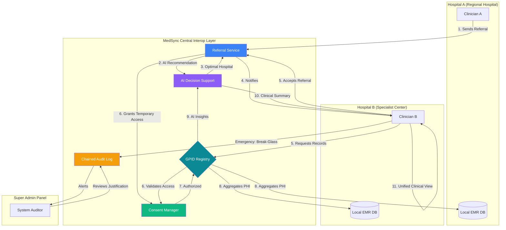

# MedSync System Overview: Multi-Hospital Interoperability

This diagram illustrates the architectural flow of the MedSync EMR system, highlighting how multiple hospitals interact through a centralized health registry and how security mechanisms (Consents & Break-Glass) are audited.

### Key Components:
1.  **GPID Registry**: A centralized database mapping national identities to local facility records.
2.  **Referral Service**: Orchestrates the transfer of patient care between facilities.
3.  **Consent Manager**: Enforces patient privacy by requiring explicit consent or an active referral for data sharing.
4.  **Chained Audit Log**: A tamper-evident ledger that records all cross-facility data access, including emergency break-glass events.
5.  **Audit Review**: A specialized interface for Super Admins to monitor and validate the legitimacy of emergency access events.
6.  **AI Decision Support**: To improve clinical decision quality within the inter-hospital context, an AI-assisted triage and referral recommendation layer was added. This identifies the optimal destination facility based on clinical urgency and specialty availability.
